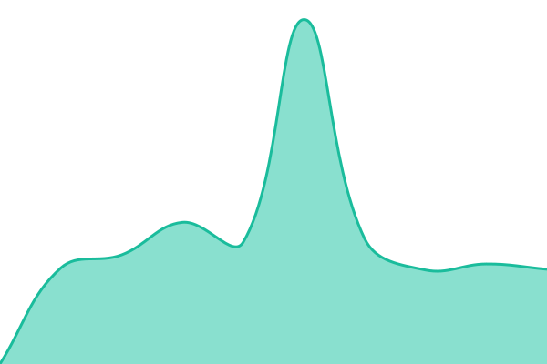

# [📈 Live Status](https://upptime.baremetalcloud.org): <!--live status--> **🟧 Partial outage**

This repository contains the open-source uptime monitor and status page for [Mateo Estrada Ramírez](https://upptime.baremetalcloud.org), powered by [Upptime](https://github.com/upptime/upptime).

With [Upptime](https://upptime.js.org), you can get your own unlimited and free uptime monitor and status page, powered entirely by a GitHub repository. We use [Issues](https://github.com/dpkg-i-foo-deb/upptime/issues) as incident reports, [Actions](https://github.com/dpkg-i-foo-deb/upptime/actions) as uptime monitors, and [Pages](https://upptime.baremetalcloud.org) for the status page.

<!--start: status pages-->
<!-- This summary is generated by Upptime (https://github.com/upptime/upptime) -->
<!-- Do not edit this manually, your changes will be overwritten -->
<!-- prettier-ignore -->
| URL | Status | History | Response Time | Uptime |
| --- | ------ | ------- | ------------- | ------ |
|  [Navidrome](https://music.baremetalcloud.org) | 🟥 Down | [navidrome.yml](https://github.com/dpkg-i-foo-deb/upptime/commits/HEAD/history/navidrome.yml) | 

 2343ms
     
 | 

<a href="https://upptime.baremetalcloud.org/history/navidrome">84.81%</a>
    

|  [Vaultwarden](https://vault.baremetalcloud.org) | 🟩 Up | [vaultwarden.yml](https://github.com/dpkg-i-foo-deb/upptime/commits/HEAD/history/vaultwarden.yml) | 

 683ms
     
 | 

<a href="https://upptime.baremetalcloud.org/history/vaultwarden">100.00%</a>
    

|  [Keycloak](https://auth.baremetalcloud.org) | 🟩 Up | [keycloak.yml](https://github.com/dpkg-i-foo-deb/upptime/commits/HEAD/history/keycloak.yml) | 

 1403ms
     
 | 

<a href="https://upptime.baremetalcloud.org/history/keycloak">100.00%</a>
    

|  [Immich](https://photos.baremetalcloud.org) | 🟥 Down | [immich.yml](https://github.com/dpkg-i-foo-deb/upptime/commits/HEAD/history/immich.yml) | 

 1569ms
     
 | 

<a href="https://upptime.baremetalcloud.org/history/immich">84.82%</a>
    

|  [Termix](https://termix.baremetalcloud.org) | 🟩 Up | [termix.yml](https://github.com/dpkg-i-foo-deb/upptime/commits/HEAD/history/termix.yml) | 

 472ms
     
 | 

<a href="https://upptime.baremetalcloud.org/history/termix">100.00%</a>
    

|  [Headscale](https://vpn.baremetalcloud.org/health) | 🟩 Up | [headscale.yml](https://github.com/dpkg-i-foo-deb/upptime/commits/HEAD/history/headscale.yml) | 

 449ms
     
 | 

<a href="https://upptime.baremetalcloud.org/history/headscale">100.00%</a>
    

|  [Trilium Notes](https://notes.baremetalcloud.org) | 🟩 Up | [trilium-notes.yml](https://github.com/dpkg-i-foo-deb/upptime/commits/HEAD/history/trilium-notes.yml) | 

 1502ms
     
 | 

<a href="https://upptime.baremetalcloud.org/history/trilium-notes">100.00%</a>
    

|  [Zot Registry](https://registry.baremetalcloud.org) | 🟥 Down | [zot-registry.yml](https://github.com/dpkg-i-foo-deb/upptime/commits/HEAD/history/zot-registry.yml) | 

 1839ms
     
 | 

<a href="https://upptime.baremetalcloud.org/history/zot-registry">84.82%</a>
    

|  [Woodpecker CI](https://woodpecker.baremetalcloud.org) | 🟥 Down | [woodpecker-ci.yml](https://github.com/dpkg-i-foo-deb/upptime/commits/HEAD/history/woodpecker-ci.yml) | 

 2566ms
     
 | 

<a href="https://upptime.baremetalcloud.org/history/woodpecker-ci">29.21%</a>
    

<!--end: status pages-->

[**Visit our status website →**](https://upptime.baremetalcloud.org)

## 📄 License

- Powered by: [Upptime](https://github.com/upptime/upptime)
- Code: [MIT](./LICENSE) © [Anand Chowdhary](https://anandchowdhary.com), supported by [Pabio](https://pabio.com)
- Data in the `./history` directory: [Open Database License](https://opendatacommons.org/licenses/odbl/1-0/)
