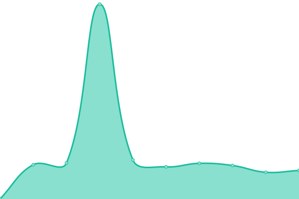

# [📈 Live Status](https://demo.upptime.js.org): <!--live status--> **🟧 Partial outage**

This repository contains the open-source uptime monitor and status page for [Upptime](https://upptime.js.org), powered by [Upptime](https://github.com/upptime/upptime).

With [Upptime](https://upptime.js.org), you can get your own unlimited and free uptime monitor and status page, powered entirely by a GitHub repository. We use [Issues](https://github.com/upptime/upptime/issues) as incident reports, [Actions](https://github.com/dpkg-i-foo-deb/upptime/actions) as uptime monitors, and [Pages](https://demo.upptime.js.org) for the status page.

<!--start: status pages-->
<!-- This summary is generated by Upptime (https://github.com/upptime/upptime) -->
<!-- Do not edit this manually, your changes will be overwritten -->
<!-- prettier-ignore -->
| URL | Status | History | Response Time | Uptime |
| --- | ------ | ------- | ------------- | ------ |
|  [Site Principal](https://vc-soft.com) | Inactivo | [site-principal.yml](https://github.com/dpkg-i-foo-deb/upptime/commits/HEAD/history/site-principal.yml) | 

 1071ms
     
 | 

<a href="https://status.vc-soft.com/history/site-principal">96.14%</a>
    

|  Portal de Autenticación | Inactivo | [portal-de-autenticacion.yml](https://github.com/dpkg-i-foo-deb/upptime/commits/HEAD/history/portal-de-autenticacion.yml) | 

 569ms
     
 | 

<a href="https://status.vc-soft.com/history/portal-de-autenticacion">96.15%</a>
    

|  VPN Soporte | Inactivo | [vpn-soporte.yml](https://github.com/dpkg-i-foo-deb/upptime/commits/HEAD/history/vpn-soporte.yml) | 

 430ms
     
 | 

<a href="https://status.vc-soft.com/history/vpn-soporte">96.16%</a>
    

|  VPN Sodimac | Inactivo | [vpn-sodimac.yml](https://github.com/dpkg-i-foo-deb/upptime/commits/HEAD/history/vpn-sodimac.yml) | 

 393ms
     
 | 

<a href="https://status.vc-soft.com/history/vpn-sodimac">96.17%</a>
    

|  VPN Davivienda | Inactivo | [vpn-davivienda.yml](https://github.com/dpkg-i-foo-deb/upptime/commits/HEAD/history/vpn-davivienda.yml) | 

 408ms
     
 | 

<a href="https://status.vc-soft.com/history/vpn-davivienda">96.18%</a>
    

|  AWX | Inactivo | [awx.yml](https://github.com/dpkg-i-foo-deb/upptime/commits/HEAD/history/awx.yml) | 

 470ms
     
 | 

<a href="https://status.vc-soft.com/history/awx">96.19%</a>
    

|  Mail | Inactivo | [mail.yml](https://github.com/dpkg-i-foo-deb/upptime/commits/HEAD/history/mail.yml) | 

 728ms
     
 | 

<a href="https://status.vc-soft.com/history/mail">96.20%</a>
    

|  [Training](https://training.vc-soft.com) | Inactivo | [training.yml](https://github.com/dpkg-i-foo-deb/upptime/commits/HEAD/history/training.yml) | 

 2301ms
     
 | 

<a href="https://status.vc-soft.com/history/training">93.99%</a>
    

|  CRM | Inactivo | [crm.yml](https://github.com/dpkg-i-foo-deb/upptime/commits/HEAD/history/crm.yml) | 

 923ms
     
 | 

<a href="https://status.vc-soft.com/history/crm">80.19%</a>
    

|  Invoice Colombia | Inactivo | [invoice-colombia.yml](https://github.com/dpkg-i-foo-deb/upptime/commits/HEAD/history/invoice-colombia.yml) | 

 876ms
     
 | 

<a href="https://status.vc-soft.com/history/invoice-colombia">80.20%</a>
    

|  Invoice Chile | Inactivo | [invoice-chile.yml](https://github.com/dpkg-i-foo-deb/upptime/commits/HEAD/history/invoice-chile.yml) | 

 862ms
     
 | 

<a href="https://status.vc-soft.com/history/invoice-chile">80.21%</a>
    

|  Invoice Argentina | Inactivo | [invoice-argentina.yml](https://github.com/dpkg-i-foo-deb/upptime/commits/HEAD/history/invoice-argentina.yml) | 

 856ms
     
 | 

<a href="https://status.vc-soft.com/history/invoice-argentina">80.22%</a>
    

|  Portal TBK Clientes | Activo | [portal-tbk-clientes.yml](https://github.com/dpkg-i-foo-deb/upptime/commits/HEAD/history/portal-tbk-clientes.yml) | 

 409ms
     
 | 

<a href="https://status.vc-soft.com/history/portal-tbk-clientes">100.00%</a>
    

|  Portal TBK Clientes Sandbox | Activo | [portal-tbk-clientes-sandbox.yml](https://github.com/dpkg-i-foo-deb/upptime/commits/HEAD/history/portal-tbk-clientes-sandbox.yml) | 

 192ms
     
 | 

<a href="https://status.vc-soft.com/history/portal-tbk-clientes-sandbox">100.00%</a>
    

|  Portal TBK Partners | Activo | [portal-tbk-partners.yml](https://github.com/dpkg-i-foo-deb/upptime/commits/HEAD/history/portal-tbk-partners.yml) | 

 117ms
     
 | 

<a href="https://status.vc-soft.com/history/portal-tbk-partners">100.00%</a>
    

|  Portal TBK Partners Sandbox | Activo | [portal-tbk-partners-sandbox.yml](https://github.com/dpkg-i-foo-deb/upptime/commits/HEAD/history/portal-tbk-partners-sandbox.yml) | 

 236ms
     
 | 

<a href="https://status.vc-soft.com/history/portal-tbk-partners-sandbox">100.00%</a>
    

<!--end: status pages-->

[**Visit our status website →**](https://demo.upptime.js.org)

## 📄 License

- Powered by: [Upptime](https://github.com/upptime/upptime)
- Code: [MIT](./LICENSE) © [Anand Chowdhary](https://anandchowdhary.com), supported by [Pabio](https://pabio.com)
- Data in the `./history` directory: [Open Database License](https://opendatacommons.org/licenses/odbl/1-0/)
