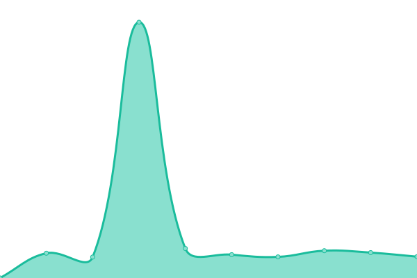

# [📈 Live Status](https://demo.upptime.js.org): <!--live status--> **🟧 Partial outage**

This repository contains the open-source uptime monitor and status page for [Upptime](https://upptime.js.org), powered by [Upptime](https://github.com/upptime/upptime).

With [Upptime](https://upptime.js.org), you can get your own unlimited and free uptime monitor and status page, powered entirely by a GitHub repository. We use [Issues](https://github.com/upptime/upptime/issues) as incident reports, [Actions](https://github.com/dpkg-i-foo-deb/upptime/actions) as uptime monitors, and [Pages](https://demo.upptime.js.org) for the status page.

<!--start: status pages-->
<!-- This summary is generated by Upptime (https://github.com/upptime/upptime) -->
<!-- Do not edit this manually, your changes will be overwritten -->
<!-- prettier-ignore -->
| URL | Status | History | Response Time | Uptime |
| --- | ------ | ------- | ------------- | ------ |
|  [Site Principal VCSOFT](https://vc-soft.com) | Activo | [site-principal-vcsoft.yml](https://github.com/dpkg-i-foo-deb/upptime/commits/HEAD/history/site-principal-vcsoft.yml) | 

 309ms
     
 | 

<a href="https://status.vc-soft.com/history/site-principal-vcsoft">99.67%</a>
    

|  [Site Secundario VCSOFT](https://www1.vc-soft.com) | Inactivo | [site-secundario-vcsoft.yml](https://github.com/dpkg-i-foo-deb/upptime/commits/HEAD/history/site-secundario-vcsoft.yml) | 

 481ms
     
 | 

<a href="https://status.vc-soft.com/history/site-secundario-vcsoft">100.00%</a>
    

|  Mail VCSOFT Roundcube | Inactivo | [mail-vcsoft-roundcube.yml](https://github.com/dpkg-i-foo-deb/upptime/commits/HEAD/history/mail-vcsoft-roundcube.yml) | 

 732ms
     
 | 

<a href="https://status.vc-soft.com/history/mail-vcsoft-roundcube">100.00%</a>
    

|  Mail VCSOFT SOGo | Inactivo | [mail-vcsoft-so-go.yml](https://github.com/dpkg-i-foo-deb/upptime/commits/HEAD/history/mail-vcsoft-so-go.yml) | 

 246ms
     
 | 

<a href="https://status.vc-soft.com/history/mail-vcsoft-so-go">100.00%</a>
    

|  [Training VCSOFT](https://training.vc-soft.com) | Inactivo | [training-vcsoft.yml](https://github.com/dpkg-i-foo-deb/upptime/commits/HEAD/history/training-vcsoft.yml) | 

 669ms
     
 | 

<a href="https://status.vc-soft.com/history/training-vcsoft">100.00%</a>
    

|  CRM VCSOFT | Inactivo | [crm-vcsoft.yml](https://github.com/dpkg-i-foo-deb/upptime/commits/HEAD/history/crm-vcsoft.yml) | 

 702ms
     
 | 

<a href="https://status.vc-soft.com/history/crm-vcsoft">100.00%</a>
    

|  Invoice Colombia | Inactivo | [invoice-colombia.yml](https://github.com/dpkg-i-foo-deb/upptime/commits/HEAD/history/invoice-colombia.yml) | 

 728ms
     
 | 

<a href="https://status.vc-soft.com/history/invoice-colombia">9.99%</a>
    

|  Invoice Chile | Inactivo | [invoice-chile.yml](https://github.com/dpkg-i-foo-deb/upptime/commits/HEAD/history/invoice-chile.yml) | 

 740ms
     
 | 

<a href="https://status.vc-soft.com/history/invoice-chile">9.99%</a>
    

|  Invoice Argentina | Inactivo | [invoice-argentina.yml](https://github.com/dpkg-i-foo-deb/upptime/commits/HEAD/history/invoice-argentina.yml) | 

 732ms
     
 | 

<a href="https://status.vc-soft.com/history/invoice-argentina">9.99%</a>
    

|  VPN VCSOFT | Activo | [vpn-vcsoft.yml](https://github.com/dpkg-i-foo-deb/upptime/commits/HEAD/history/vpn-vcsoft.yml) | 

 84ms
     
 | 

<a href="https://status.vc-soft.com/history/vpn-vcsoft">100.00%</a>
    

<!--end: status pages-->

[**Visit our status website →**](https://demo.upptime.js.org)

## 📄 License

- Powered by: [Upptime](https://github.com/upptime/upptime)
- Code: [MIT](./LICENSE) © [Anand Chowdhary](https://anandchowdhary.com), supported by [Pabio](https://pabio.com)
- Data in the `./history` directory: [Open Database License](https://opendatacommons.org/licenses/odbl/1-0/)
